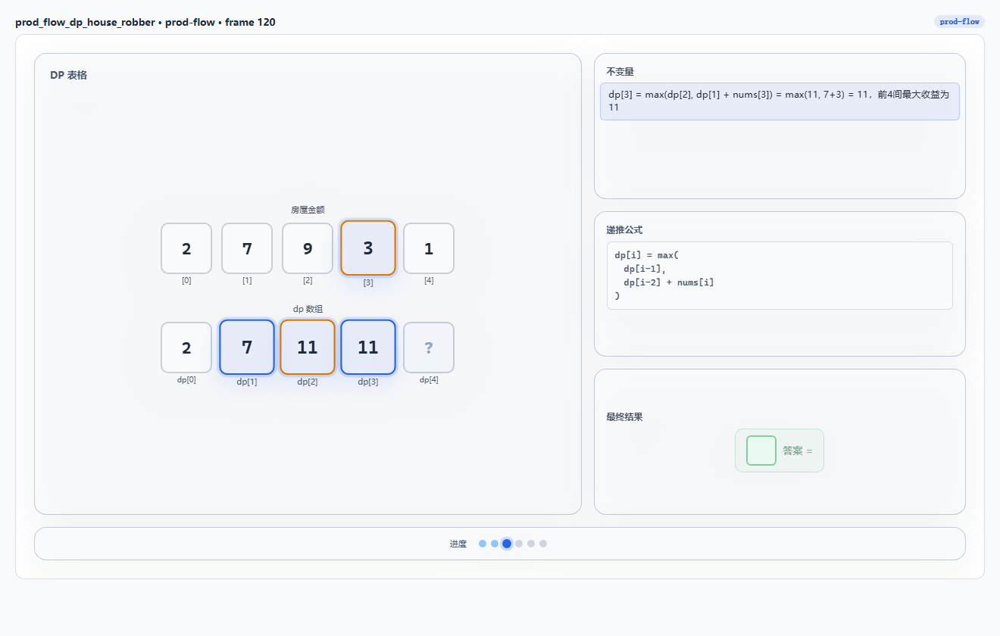
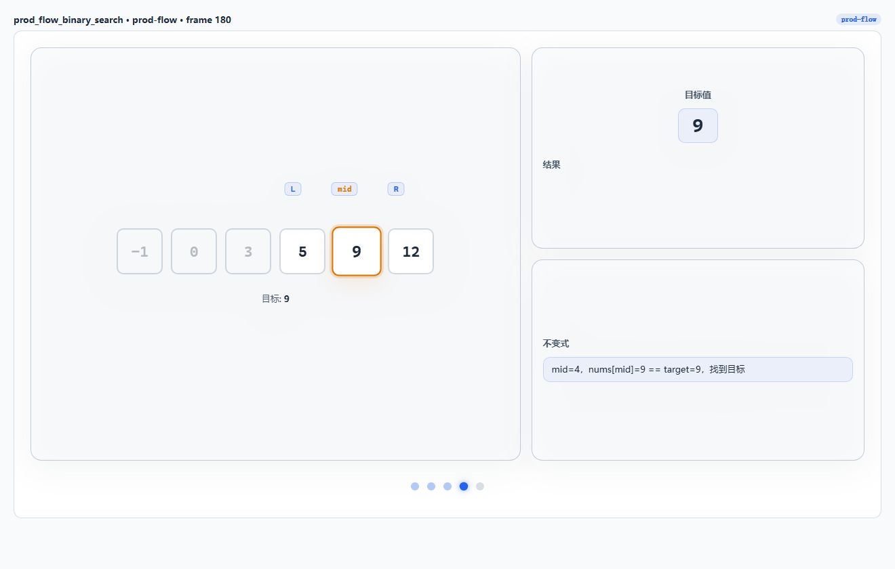
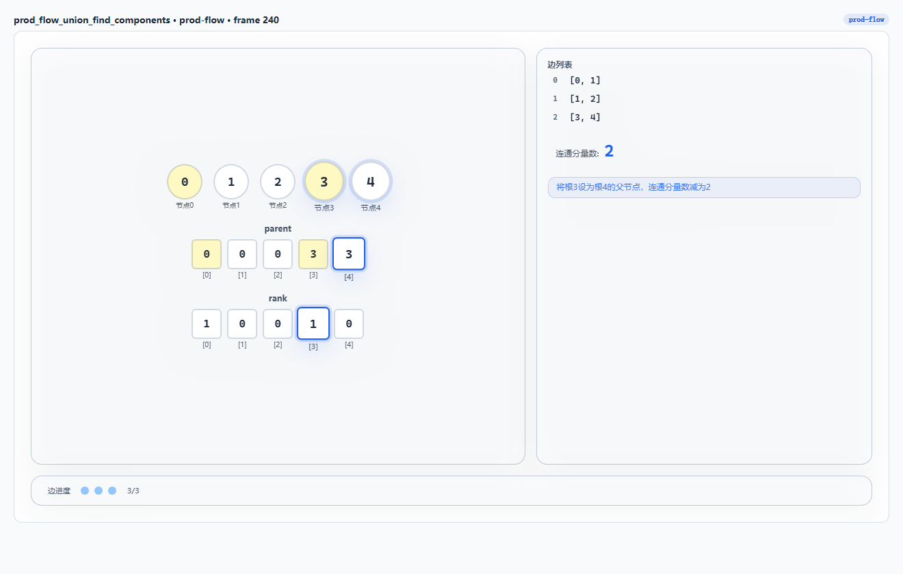

# AI Coding Coach Web

AI-powered coding coach with problem understanding, code review, runtime feedback, learning traces, and algorithm visualization.

## Latest AlgoViz renders

These screenshots are generated from the current production AlgoViz flow: Trace chooses the template, VisualPlan receives the layout hint, and Animation receives the motion template.







More screenshots are in [`screenshots/`](./screenshots/).

## Development

```bash
npm install
npm run dev
```

## Validation

```bash
npm run typecheck
```
